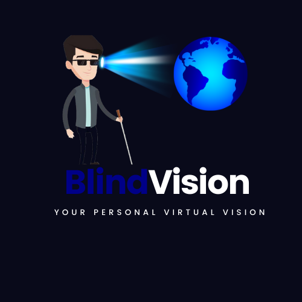
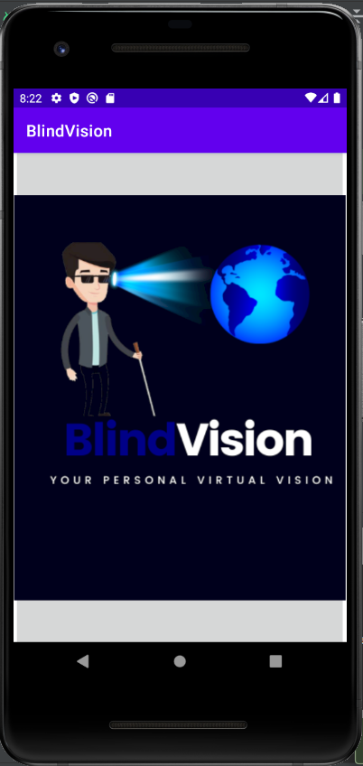
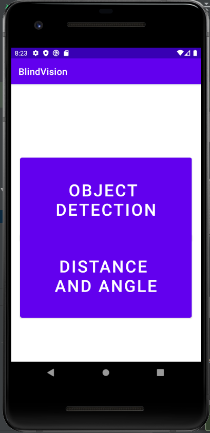
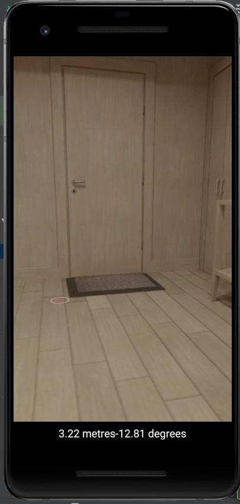
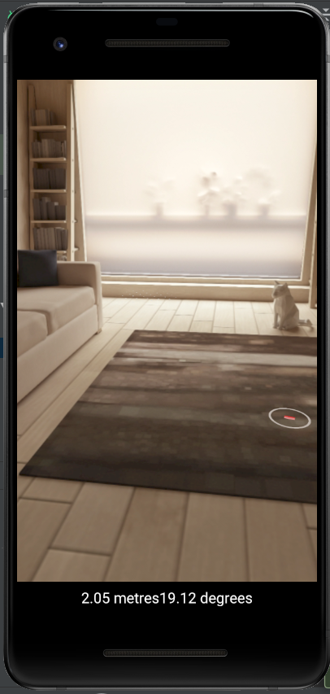

<!--
*** Thanks for checking out the Best-README-Template. If you have a suggestion
*** that would make this better, please fork the repo and create a pull request
*** or simply open an issue with the tag "enhancement".
*** Thanks again! Now go create something AMAZING! :D
-->


<!-- PROJECT SHIELDS -->
<!--
*** I'm using markdown "reference style" links for readability.
*** Reference links are enclosed in brackets [ ] instead of parentheses ( ).
*** See the bottom of this document for the declaration of the reference variables
*** for contributors-url, forks-url, etc. This is an optional, concise syntax you may use.
*** https://www.markdownguide.org/basic-syntax/#reference-style-links
-->

<!-- PROJECT LOGO -->
<br />
<p align="center">
  <a href=" HassanRaza1313/Real-Time-Object-Detection-and-Distance-Measurement-Android (github.com)">
    
  </a>

  <h3 align="center">BlindVision</h3>

  <p align="center">
    - A Real-Time Object Detection and Distance Measurement Application for Android
    <br />
  </p>
</p>


<!-- TABLE OF CONTENTS -->
<details open="open">
  <summary>Table of Contents</summary>
  <ol>
    <li>
      <a href="#about-the-project">About The Project</a>
      <ul>
        <li><a href="#built-with">Built With</a></li>
      </ul>
    </li>
    <li>
      <a href="#getting-started">Getting Started</a>
      <ul>
        <li><a href="#prerequisites">Prerequisites</a></li>
      </ul>
    </li>
    <li><a href="#usage">Usage</a></li>
    <li><a href="#roadmap">Roadmap</a></li>
    <li><a href="#contributing">Contributing</a></li>
    <li><a href="#license">License</a></li>
    <li><a href="#contact">Contact</a></li>
    <li><a href="#acknowledgements">Acknowledgements</a></li>
  </ol>
</details>


<!-- ABOUT THE PROJECT -->
## About The Project

Blind Vision is an android application that will help blind and visually impaired people commute in recreational areas such as parks, restaurants, etc. by making them aware of their environment. BlindVision is a user-friendly application that the blind person can easily access and use without any human intervention. My application will become the third eye for the blind/visually impaired person.

The Problem is that blind and visually impaired people commute and travel in their day to day lives with the help of walking sticks or human companions. It's impact is that it reduces the blind person's ability to perform daily tasks and can affect the ability to interact with the surrounding world. My application for both blind and visually impaired people in an easily accessible way to commute and travel in their day-to-day lives. My application provides an effective, efficient and human-friendly solution to the problem. 

Using the phone's camera, the application detects and classifies the objects around the blind person and informs them via audio. The application also prives a mechanism to calculate real-time distance and angle from a point in the real world by tapping on the screen.

### Built With

* [Android Studio](https://developer.android.com/studio)
* [Tensorflow](https://www.tensorflow.org)
* [Google ML Kit](https://developers.google.com/ml-kit)
* [Google ARCore](https://developers.google.com/ar)


<!-- GETTING STARTED -->
## Getting Started

* Download and setup Android Studio on your system.
* Download the project files from this repository.
* Load the project on Android Studio and sync Gradle files.
* Your project is up-and-running.


### Prerequisites

This application only works with AR-compatible phones. To see the list of AR compatible phones, visit the link.

```sh
  https://developers.google.com/ar/discover/supported-devices
  ```

You need to install Google Play Services for AR to run this app. To download it, visit the link:
```sh
 https://play.google.com/store/apps/details?id=com.google.ar.core&hl=en&gl=US
  ```

This application uses the following dependencies:
  ```sh
    implementation 'com.google.mlkit:object-detection:16.2.2'
    implementation 'com.google.mlkit:object-detection-custom:16.3.1'
    implementation 'com.google.mlkit:image-labeling:17.0.1'
    implementation 'com.google.ar.sceneform.ux:sceneform-ux:1.10.0'
  ```
  
<!-- USAGE EXAMPLES -->
## Usage









<!-- ROADMAP -->
## Roadmap

See the [open issues](https://github.com/othneildrew/Best-README-Template/issues) for a list of proposed features (and known issues).


<!-- CONTRIBUTING -->
## Contributing

Contributions are what make the open source community such an amazing place to be learn, inspire, and create. Any contributions you make are **greatly appreciated**.

1. Fork the Project
2. Create your Feature Branch (`git checkout -b feature/AmazingFeature`)
3. Commit your Changes (`git commit -m 'Add some AmazingFeature'`)
4. Push to the Branch (`git push origin feature/AmazingFeature`)
5. Open a Pull Request


<!-- LICENSE -->
## License

Distributed under the MIT License. See `LICENSE` for more information.


<!-- CONTACT -->
## Contact

Your Name - [@your_twitter](https://twitter.com/your_username) - email@example.com

Project Link: [https://github.com/your_username/repo_name](https://github.com/your_username/repo_name)


<!-- ACKNOWLEDGEMENTS -->
## Acknowledgements
* [GitHub Emoji Cheat Sheet](https://www.webpagefx.com/tools/emoji-cheat-sheet)
* [Img Shields](https://shields.io)
* [Choose an Open Source License](https://choosealicense.com)
* [GitHub Pages](https://pages.github.com)
* [Animate.css](https://daneden.github.io/animate.css)
* [Loaders.css](https://connoratherton.com/loaders)
* [Slick Carousel](https://kenwheeler.github.io/slick)
* [Smooth Scroll](https://github.com/cferdinandi/smooth-scroll)
* [Sticky Kit](http://leafo.net/sticky-kit)
* [JVectorMap](http://jvectormap.com)
* [Font Awesome](https://fontawesome.com)


<!-- MARKDOWN LINKS & IMAGES -->
<!-- https://www.markdownguide.org/basic-syntax/#reference-style-links -->
[contributors-shield]: https://img.shields.io/github/contributors/othneildrew/Best-README-Template.svg?style=for-the-badge
[contributors-url]: https://github.com/othneildrew/Best-README-Template/graphs/contributors
[forks-shield]: https://img.shields.io/github/forks/othneildrew/Best-README-Template.svg?style=for-the-badge
[forks-url]: https://github.com/othneildrew/Best-README-Template/network/members
[stars-shield]: https://img.shields.io/github/stars/othneildrew/Best-README-Template.svg?style=for-the-badge
[stars-url]: https://github.com/othneildrew/Best-README-Template/stargazers
[issues-shield]: https://img.shields.io/github/issues/othneildrew/Best-README-Template.svg?style=for-the-badge
[issues-url]: https://github.com/othneildrew/Best-README-Template/issues
[license-shield]: https://img.shields.io/github/license/othneildrew/Best-README-Template.svg?style=for-the-badge
[license-url]: https://github.com/othneildrew/Best-README-Template/blob/master/LICENSE.txt
[linkedin-shield]: https://img.shields.io/badge/-LinkedIn-black.svg?style=for-the-badge&logo=linkedin&colorB=555
[linkedin-url]: https://linkedin.com/in/othneildrew
[product-screenshot]: images/screenshot.png
